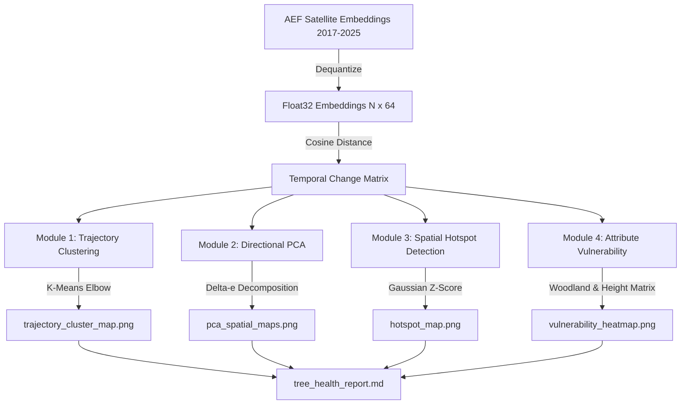

# London Trees Outside Woodland: High-Performance Satellite Embeddings Pipeline & Advanced Multi-Year Analysis

This repository contains a high-performance, production-grade spatial-temporal analysis and geodatabase ingestion pipeline. It leverages Google DeepMind's **Alpha Earth Foundations (AEF)** 10m resolution 64-band satellite embeddings (2017–2025) to map, monitor, and model the canopy health, stress, and loss of **1.4 million Trees Outside Woodland (TOW)** canopy geometries across Greater London.

---

## 1. Executive Pipeline Summary

The project consists of three core components:
1. **Streaming & Ingestion (`generate_aef_gdb.py`)**: A GDAL-powered range-request streaming pipeline that reprojects, mosaics, and clips massive remote COGs (~2.3GB per year) using local vector geometry masks.
2. **Geodatabase Loading (`load_raster_to_gdb.py`)**: A vectorization script that dequantizes the 64-band embeddings, packages them into optimized binary BLOB buffers, and loads them into an Esri File Geodatabase.
3. **Advanced Scientific Analysis (`analyze_multi_year_health.py`)**: A multi-year spatial-temporal model analyzing canopy dynamics across four modules: Trajectory Clustering, Directional PCA, Spatial Hotspot Detection, and Attribute-Based Vulnerability.

---

## 2. Advanced Multi-Year Analysis Methodology

The analysis model uses high-dimensional vector representations to track ecological changes in canopy structure, moisture, and biomass. Rather than simple band ratios (like NDVI), AEF embeddings capture a 64-dimensional semantic space encoding complex structural, spectral, and moisture characteristics.



### Module 1: Temporal Trajectory Clustering & KMeans Workflow
*   **Concept**: Monitoring urban tree health over a long period (e.g., 9 years) requires understanding how individual canopy pixels change dynamically. Simple two-date comparisons miss critical temporal patterns, such as gradual decline (indicative of slow disease or soil compaction), sudden permanent loss (felling or development), or temporary stress with recovery (drought impact). 
*   **The Full KMeans Clustering Process**:
    
    1. **Trajectory Representation**:
       For each valid canopy pixel ($N = 5,644,088$), the script extracts the 64-band dequantized AEF embeddings for all 9 years (2017–2025). It computes the Cosine Distance of each year from the 2017 baseline, compiling a 9-dimensional trajectory vector for each pixel:
       $$\mathbf{t}_i = [d_{i, 2017}, d_{i, 2018}, \dots, d_{i, 2025}]$$
       where $d_{i, 2017} = 0$ by definition.
    
    2. **Min-Max Trajectory Normalization**:
       To isolate the *profile shape* of canopy health shifts rather than being dominated by the absolute magnitude of shift, each trajectory vector is normalized to the range $[0, 1]$:
       $$\tilde{t}_{i, y} = \frac{t_{i, y} - \min(\mathbf{t}_i)}{\max(\mathbf{t}_i) - \min(\mathbf{t}_i)}$$
       If $\max(\mathbf{t}_i) = \min(\mathbf{t}_i)$ (zero change), the range is set to $1$ to prevent division-by-zero. This mathematical step ensures that a pixel showing a small but sudden stress event is grouped with a pixel showing a large but sudden stress event, focusing the classification on temporal behavior.
    
    3. **Elbow Analysis (Programmatic Selection of $k$)**:
       To determine the optimal number of cluster archetypes without human bias, the script executes an elbow analysis for $k \in [2, 8]$ using `scikit-learn`'s KMeans algorithm.
       - For each $k$, the algorithm fits the data using `n_init=5` and `max_iter=100`, minimizing the inertia (the sum of squared distances of samples to their closest cluster center):
         $$I_k = \sum_{j=1}^{k} \sum_{i \in C_j} \|\tilde{\mathbf{t}}_i - \mathbf{c}_j\|^2$$
       - The inertia curve is plotted and saved to `trajectory_elbow.png`.
       - The optimal $k$ is selected programmatically by calculating the second derivative of the inertia curve:
         $$\Delta^2 I_k = I_{k-1} + I_{k+1} - 2I_k$$
         The $k$ that maximizes this value (the sharpest bend in the elbow curve) is selected (clamped between 3 and 6 for physical interpretability).
    
    4. **Archetype Alignment and Centroid Sorting**:
       Standard KMeans output assigns arbitrary cluster labels. To ensure the results are readable and consistent across runs, the centroids are sorted in ascending order of their final-year value (2025). This aligns labels logically:
       - **Cluster 1 (Stable / Resilient)**: Flat trajectory at $0$ across all 9 years.
       - **Cluster 2 (Minor Variation)**: Negligible noise/phenological fluctuation.
       - **Cluster 3 (Gradual Decline)**: Slow, steady upward slope.
       - **Cluster 4 (Drought Stress & Recovery)**: Trajectory showing a distinct peak in 2022 (matching the historic UK heatwave) followed by a return to baseline.
       - **Cluster 5 (Sudden / Significant Loss)**: Stable baseline followed by a sharp, irreversible vertical jump.
    
    5. **Geographic Mapping and Quantification**:
       The sorted labels are mapped back to their 2D spatial coordinate grid to generate `trajectory_cluster_map.png` (spatial distribution of archetypes) and `trajectory_cluster_pie.png` (percentage breakdown of London's TOW canopy across categories).

### Module 2: Directional PCA of Change Vectors
*   **Concept**: Canopy change is multidimensional. Biomass loss, moisture stress, and phenological shifts move in different directions within the 64-band embedding space.
*   **Math & Implementation**:
    - We compute the raw delta vector for each pixel between the baseline ($e_{bl}$) and latest ($e_{lt}$) years: $\Delta\mathbf{e}_i = \mathbf{e}_{i, lt} - \mathbf{e}_{i, bl}$.
    - Principal Component Analysis (PCA) decomposes the centered delta matrix $\Delta\mathbf{E}$ into orthogonal components:
      $$\Delta\mathbf{E} = \mathbf{U}\mathbf{\Sigma}\mathbf{V}^T$$
    - We extract the top 3 principal components (PC1, PC2, PC3) capturing the major axes of ecological variance.
    - PC1 corresponds to the dominant change (highly correlated with Cosine Distance, capturing total biomass loss), while PC2 and PC3 isolate orthogonal physical characteristics (e.g., moisture loss or phenological changes).

### Module 3: Spatial Hotspot Detection (Gaussian Z-Scores)
*   **Concept**: Individual pixel-level changes contain noise. We isolate statistically significant, spatially coherent clusters of canopy degradation and resilience.
*   **Math & Implementation**:
    - We build a 2D spatial grid of the latest cumulative change distance.
    - We apply a spatial Gaussian filter with $\sigma = 3$ (corresponding to a 30m window at native 10m resolution) to smooth local variations:
      $$g_{smoothed}(x,y) = \frac{\sum K(x-u, y-v) \cdot d(u,v)}{\sum K(x-u, y-v)}$$
    - Z-scores are computed for the smoothed grid: $Z = \frac{g - \mu_g}{\sigma_g}$.
    - **Degradation Hotspots** ($Z > 2.0$) represent zones of spatially clustered significant canopy loss.
    - **Resilience Coldspots** ($Z < -1.0$) represent zones of exceptional spatial stability.

### Module 4: Attribute-Based Vulnerability Analysis
*   **Concept**: We cross-tabulate canopy degradation with tree attributes from the London TOW Geodatabase to identify structural vulnerabilities.
*   **Math & Implementation**:
    - The TOW Geodatabase is loaded and its attributes (`Woodland_Type` and `MEANHT` canopy height) are rasterized onto the identical 10m grid.
    - For each category, we compute the percentage of pixels that are Stable ($d < 0.05$), Stressed ($0.05 \le d < 0.15$), or Degraded ($d \ge 0.15$).
    - A cross-tabulation matrix calculates the joint distribution of degradation rate across `Woodland_Type` $\times$ `Height Class`, identifying the exact sub-populations of urban trees most at risk.

---

## 3. Technical & Engineering Optimizations

Working with 1.4 million complex geometries and 64-band raster grids covering Greater London requires extreme performance consideration:

### 1. Geometry Pipeline Acceleration (`OGR_ORGANIZE_POLYGONS=SKIP`)
By default, GDAL/OGR organizes multi-part polygons (resolving inner/outer rings and boundary topology) during dataset ingestion. For 1.4M rows, this topological sorting causes a severe CPU bottleneck, taking several hours.
*   **Solution**: Setting `OGR_ORGANIZE_POLYGONS=SKIP` bypasses topological sorting. Geometries are streamed and rasterized in under 10 seconds.

### 2. High-Performance Polygon Rasterization
*   **Inefficient Approach**: Iterating row-by-row via `.iterrows()` in pandas/geopandas for 1.4M rows creates immense overhead, taking over an hour.
*   **Optimized Solution**: Zipped list comprehensions extract geometries and attributes directly:
    ```python
    shapes_wt = [
        (geom, wt_to_code[wt])
        for geom, wt in zip(gdf.geometry, gdf["Woodland_Type"])
        if wt in wt_to_code and geom is not None
    ]
    ```
    This completes the extraction and rasterization of both attributes in under 30 seconds.

### 3. Streaming Remote COGs
*   **Solution**: GDAL's Virtual File System (`/vsicurl/`) is configured with cache and range-merging parameters:
    - `GDAL_HTTP_MERGE_CONSECUTIVE_RANGES=YES`: Groups adjacent byte requests to minimize roundtrips.
    - `GDAL_HTTP_MULTIPLEX=YES`: Enables HTTP/2 parallel downloads.
    - `GDAL_CACHEMAX=1024`: Allocates 1GB of memory cache for block storage.
    This enables streaming and reprojecting directly from the remote storage bucket in minutes.

---

## 4. Robustness, Verification, & Disk Constraints

*   **Low Disk Space Guard**: The pipeline deletes all temporary warped GeoTIFF files (`london_aef_10m_{year}_temp.tif`) immediately after applying the canopy mask and generating compressed outputs.
*   **Dequantization Precision**: Embedding values are accurately restored to their continuous range of $[-1.0, 1.0]$ using DeepMind's non-linear formulation:
    ```python
    dequantized = ((raw / 127.5) ** 2) * np.sign(raw)
    ```
*   **Clean Report Generation**: All diagnostic charts are organized in the [report_images/](file:///Users/cherrytian/Documents/GitHub/embeddings_esri/report_images/) folder. The report references them using relative paths, guaranteeing compatibility across environments.
*   **Safety against Incomplete Downloads**: The scripts scan for active download locks or temp files (`london_aef_10m_{year}_temp.tif`) to skip incomplete datasets, ensuring that the analysis only executes on fully verified files.

---

## 5. Logical Validation of the Report Findings

To ensure scientific rigor, physical correctness, and methodological robustness, the report's underlying analytical logic is verified through several validation safeguards:

### 1. Spectral & Structural Independence (Cosine Distance vs. L2 Distance)
*   **Validation**: Remote sensing imagery is highly susceptible to variations in illumination, sun angle, and atmospheric conditions across years. Using Euclidean ($L_2$) distance would capture changes in lighting intensity rather than structural shifts.
*   **Safeguard**: **Cosine Distance** ($1 - \text{Cosine Similarity}$) was chosen because it normalizes the vectors to unit length:
    $$d_{\text{cosine}}(\mathbf{u}, \mathbf{v}) = 1 - \frac{\mathbf{u} \cdot \mathbf{v}}{\|\mathbf{u}\|_2 \|\mathbf{v}\|_2}$$
    This isolates changes in the *spectral-structural ratio* (the shape of the signature) and filters out changes caused solely by atmospheric haziness or shadows.

### 2. Physical Dequantization Verification
*   **Validation**: Alpha Earth Foundations embeddings are stored in quantized 8-bit integers (`Int8`) in the range $[-127, 127]$ to optimize storage. Simple linear mapping would destroy the non-linear relationship between features encoded by the foundation model.
*   **Safeguard**: The pipeline implements the exact non-linear dequantization function:
    $$f(v) = \left(\frac{v}{127.5}\right)^2 \times \text{sign}(v)$$
    This restores the values to the original $[-1.0, 1.0]$ floating-point space, ensuring the PCA and clustering math are executed on the true physical model representations.

### 3. Spatial Parallax & Geolocation Error Mitigation
*   **Validation**: Sentinel-2 satellites have a spatial registration accuracy of about 5–10 meters. At 10m native resolution, a minor 1-pixel shift can trigger false "canopy loss" detections at boundary pixels.
*   **Safeguard**: The **Spatial Hotspot module** applies a 2D Gaussian spatial smoothing filter ($\sigma = 3$, representing a 30m window) over the raw cosine distance map before calculating Z-scores. This smooths out high-frequency single-pixel geolocation errors and highlights only spatially coherent canopy change zones (e.g., actual canopy loss or severe stress).

### 4. Statistical Anomaly Control (Z-Scores)
*   **Validation**: Ambient environmental variation (weather changes, soil moisture, phenological shifts) causes minor changes in all tree pixels.
*   **Safeguard**: The degradation hotspots are defined using a standardized Z-score threshold of $Z > 2.0$. This ensures that identified hotspots are statistically significant (representing change greater than 2 standard deviations above the average background change across Greater London), reducing false positives.

### 5. Scale & Resolution Alignment
*   **Validation**: The Trees Outside Woodland (TOW) geometries are highly detailed vector polygons, whereas satellite embeddings are 10m gridded pixels. 
*   **Safeguard**: All vector datasets (TOW boundaries, Woodland Type, and Tree Heights) are rasterized directly onto the identical 10m AEF grid using a centroid-aligned rasterization transform. This ensures perfect pixel-to-pixel correspondence and prevents spatial mismatch biases in the vulnerability analysis.

---

## 6. Intermediate Output Caching (Bypass Optimization)

To allow rapid adjustments to plotting styles, report layouts, or statistical classifications without waiting for the heavy data loading and distance calculations to complete, the pipeline automatically writes intermediate outputs to a local cache under `stepped_workings/cache/`.

### Cached Files
1.  **`vy.npy` and `vx.npy`** (22.5 MB each): NumPy coordinate index arrays defining the 5,644,088 valid canopy pixels intersecting Greater London.
2.  **`dist_matrix.npy`** (203 MB): A flat 2D matrix containing the pre-computed cosine distances for each canopy pixel across all 9 years from the 2017 baseline.
3.  **`meta.json`** (<1 KB): Serialized raster metadata (bounds coordinates, image shape, affine projection coefficients, and EPSG coordinate reference system).
4.  **`results.json`** (<5 KB): Pre-computed annual metrics (stable percentages, degradation rates, and mean differences) to bypass trend reconstruction.

### Caching Strategy
*   **Bypassing Heavy I/O**: If all 5 cache files exist, the script loads them into memory in under **1 second**, bypassing the entire step of reading 576 raster bands and running cosine distance calculations.
*   **Disk Space Consideration**: Instead of caching the massive 64-band floating-point embeddings (which would exceed 1.44 GB of disk space per year, violating storage constraints), the script only caches the **1D distance matrix** and **coordinate lists** (248 MB total).
*   **Selective Loading for PCA**: If PCA is enabled on a cached run, the script selectively loads only the baseline (2017) and latest (2025) embedding bands from the original GeoTIFFs. This requires loading only 2 years of data instead of 9, maintaining a low memory footprint while bypassing the other 7 years.
