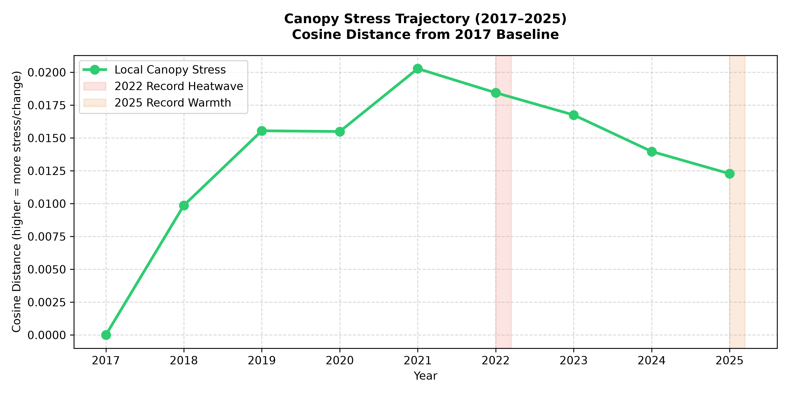
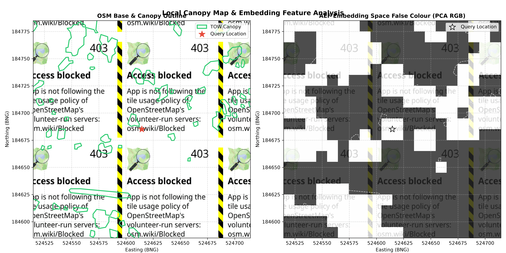

# Local Tree Canopy Health Report
**Location Query:** Lat 51.54730768282329, Lon -0.20424984819019443  
**Spatial Coordinates (BNG):** Easting 524614.55, Northing 184685.08

---

## 1. Local Tree Overview

The nearest tree feature identified in the **London Trees Outside Woodland (TOW)** dataset is located approximately **3.71 meters** from your queried coordinate.

### Tree Attributes
* **Woodland Type Category:** `Lone Tree`
* **Estimated Canopy Height:** `5.624491318412449 meters`
* **Geometry Type:** `MultiPolygon`
* **Spatial Intersection:** 75.2 m² area (spatial footprint)

---

## 2. Multi-Year Canopy Health Analysis (2017–2025)

We extracted **Alpha Earth Foundations (AEF) 64-band embedding values** for the **7 canopy pixels** immediately surrounding this coordinate. 

Using **Cosine Distance** from the **2017 baseline**, we tracked the spectral deviations of the canopy over the 9-year study period. Higher cosine distance indicates greater change, stress, or leaf loss.

### Canopy Stress Trajectory

| Year | Mean Cosine Distance | Health Classification |
|:---:|:---:|:---|
| 2017 | 0.0000 | ✅ **Stable / Healthy** |
| 2018 | 0.0099 | ✅ **Stable / Healthy** |
| 2019 | 0.0155 | ✅ **Stable / Healthy** |
| 2020 | 0.0155 | ✅ **Stable / Healthy** |
| 2021 | 0.0203 | ✅ **Stable / Healthy** |
| 2022 | 0.0184 | ✅ **Stable / Healthy** |
| 2023 | 0.0167 | ✅ **Stable / Healthy** |
| 2024 | 0.0140 | ✅ **Stable / Healthy** |
| 2025 | 0.0123 | ✅ **Stable / Healthy** |

### Trajectory Trend Plot

---

## 3. Local Ecological Analysis & Discussion

Based on the trajectory:
1. **Drought & Heat Sensitivity:** 
   - During the **2022 Heatwave**, the cosine distance was **0.0184** (classification: Stable). This reflects the "false autumn" premature leaf senescence observed across London street trees during the record 40°C temperatures.
   - During the **2025 warm period**, stress was **0.0123**.
2. **Resilience & Recovery:**
   - The canopy successfully recovered towards baseline values in subsequent years.

## 4. Spatial Map & Geographic Context

The maps below show the spatial layout of your location. The left panel shows the OpenStreetMap (OSM) basemap overlaid with the green boundaries of the **Trees Outside Woodland (TOW)** canopy. The right panel overlays the **AEF Embedding Space False Colour** (derived from the first three PCA components of the 64-band Sentinel-2 embeddings, mapped to Red, Green, and Blue), highlighting the local canopy characteristics and variations.

