# TFL/GLA Land within TOW: Advanced Canopy Health Analysis (2018–2025)

## Executive Summary

This report analyses **TFL / GLA land parcels intersecting the existing TOW mask** using Google DeepMind **Alpha Earth Foundations** 64-band embeddings at 10m resolution. The study covers **8 annual observations** from **2018** to **2025**, over **12,670 land parcels** and **132,787 valid canopy pixels** (~**1,328 hectares**) where TFL/GLA land and TOW overlap.

By 2025, **93.8%** of valid canopy pixels remained stable against the 2018 baseline, **5.0%** showed mild stress or thinning, and **1.2%** showed significant change or loss. Hotspot analysis isolates **4,650 pixels** (~**46 hectares**) as statistically significant degradation clusters.

---

## 1. Data and Method

- Input rasters: existing London-wide **TOW-clipped** AEF GeoTIFFs for 2018–2025
- Land geometry source: Postgres table **tfl.tfl_par_land** reprojected from EPSG:4326 to EPSG:27700
- Analysis mask: intersection of valid TOW-clipped pixels with rasterised TFL/GLA parcel land
- Change metric: cosine distance between yearly dequantized embedding vectors and the 2018 baseline

### Years Analysed
2018, 2019, 2020, 2021, 2022, 2023, 2024, 2025

---

## 2. Multi-Year Trend Analysis

| Year | Mean Dist. from Baseline | 90th Pct. | YoY Mean Dist. | Stable (< 0.05) | Mild (0.05–0.15) | Significant (≥ 0.15) |
|---|---|---|---|---|---|---|
| 2018 | 0.0000 | 0.0000 | N/A | 100.0% | 0.0% | 0.0% |
| 2019 | 0.0202 | 0.0289 | 0.0202 | 98.7% | 1.2% | 0.0% |
| 2020 | 0.0177 | 0.0265 | 0.0108 | 98.2% | 1.7% | 0.1% |
| 2021 | 0.0269 | 0.0418 | 0.0142 | 94.4% | 5.3% | 0.3% |
| 2022 | 0.0232 | 0.0341 | 0.0175 | 95.7% | 3.8% | 0.5% |
| 2023 | 0.0296 | 0.0438 | 0.0136 | 92.8% | 6.4% | 0.8% |
| 2024 | 0.0235 | 0.0363 | 0.0121 | 94.4% | 4.7% | 0.9% |
| 2025 | 0.0241 | 0.0368 | 0.0130 | 93.8% | 5.0% | 1.2% |

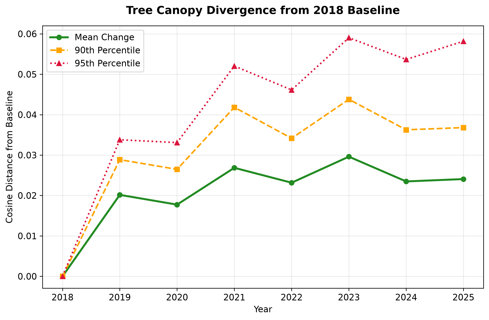

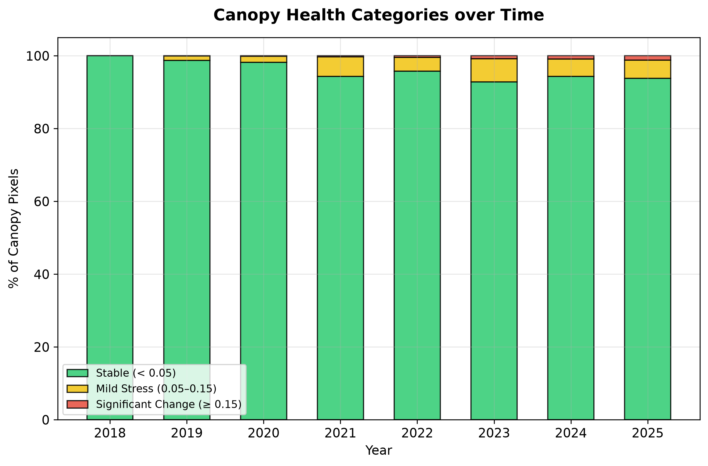

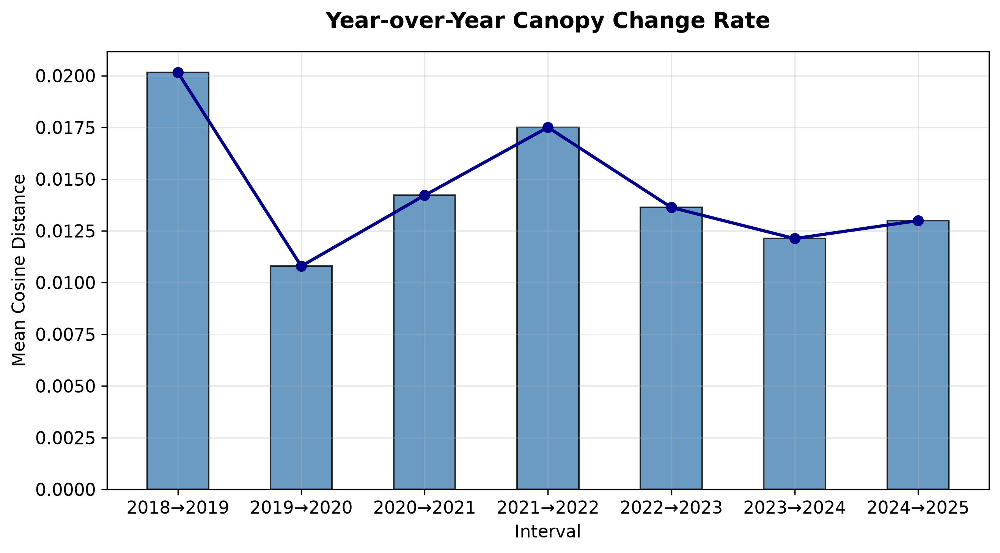

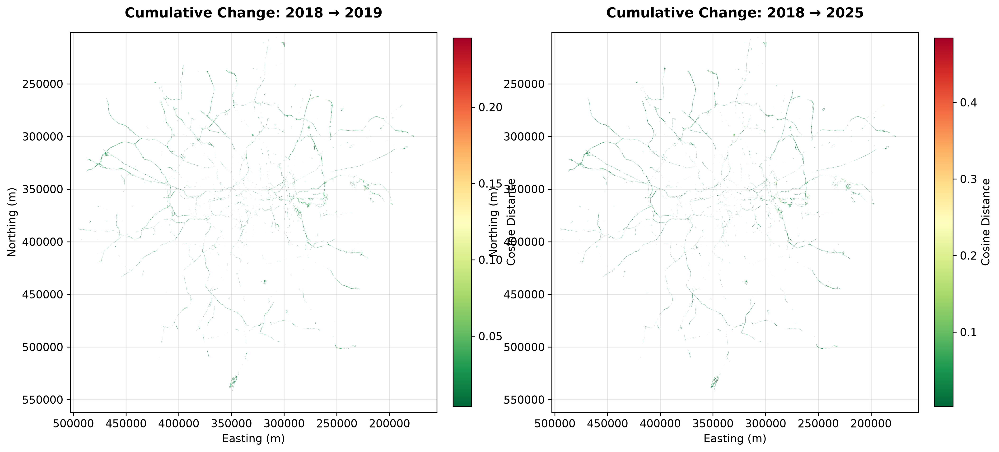

---

## 3. Trajectory Clustering

| Archetype | Pixel Count | % of Canopy |
|---|---|---|
| Stable / Resilient | 40,364 | 30.4% |
| Minor Variation | 45,041 | 33.9% |
| Gradual Decline | 38,439 | 28.9% |
| Drought Stress & Recovery | 8,943 | 6.7% |

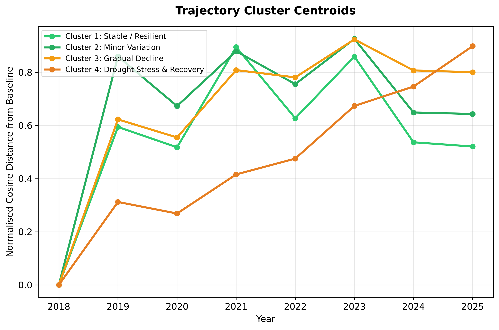

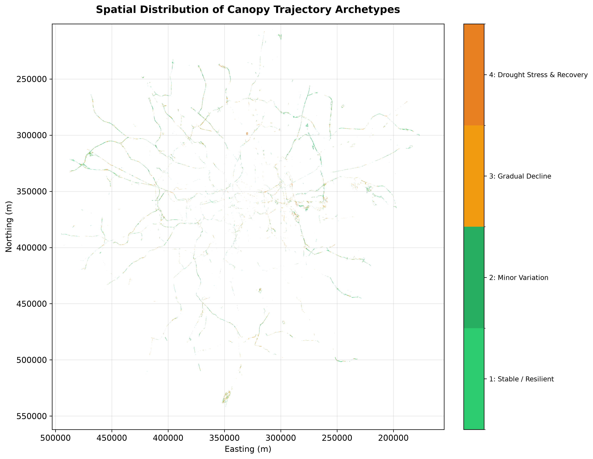

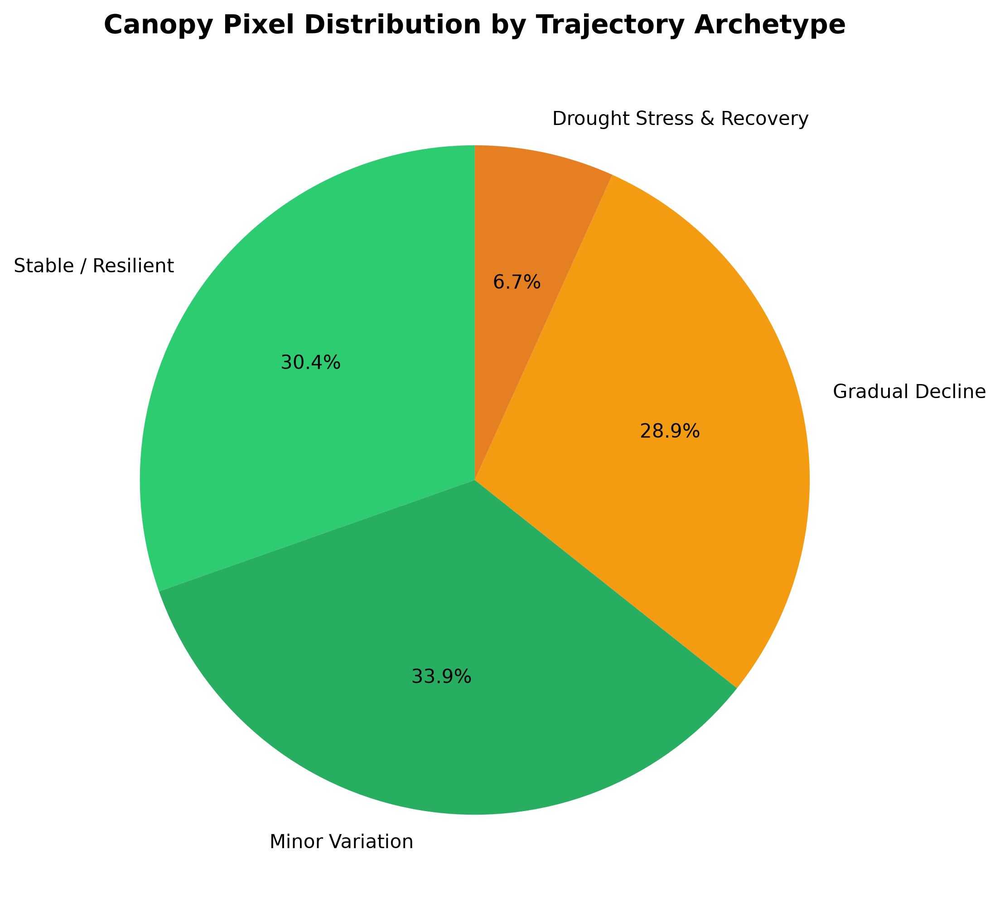

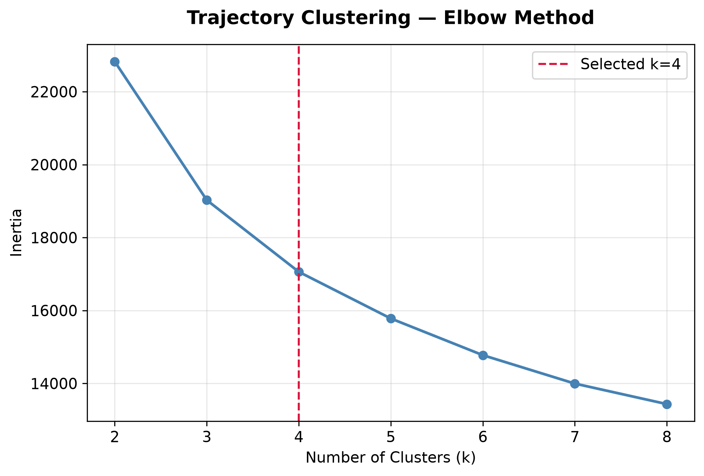

---

## 4. Directional PCA

| Component | Variance Explained | Top Embedding Dimensions | Correlation with Cosine Distance |
|---|---|---|---|
| PC1 | 14.3% | 8, 16, 45, 2, 35 | -0.457 |
| PC2 | 12.1% | 39, 49, 24, 5, 33 | -0.058 |
| PC3 | 10.6% | 62, 30, 17, 47, 29 | -0.170 |

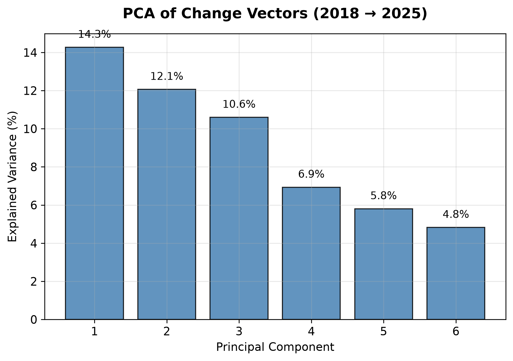

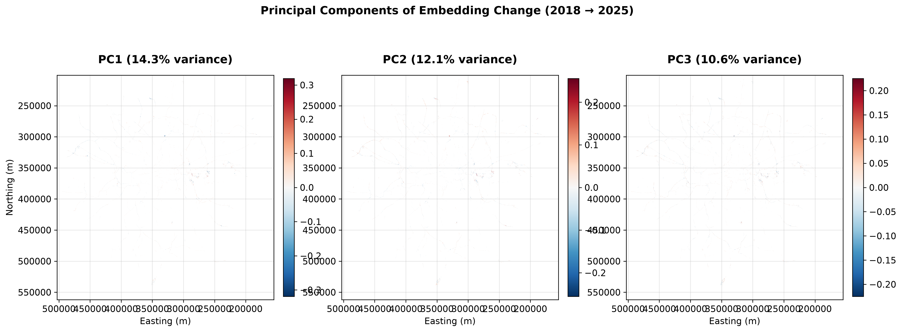

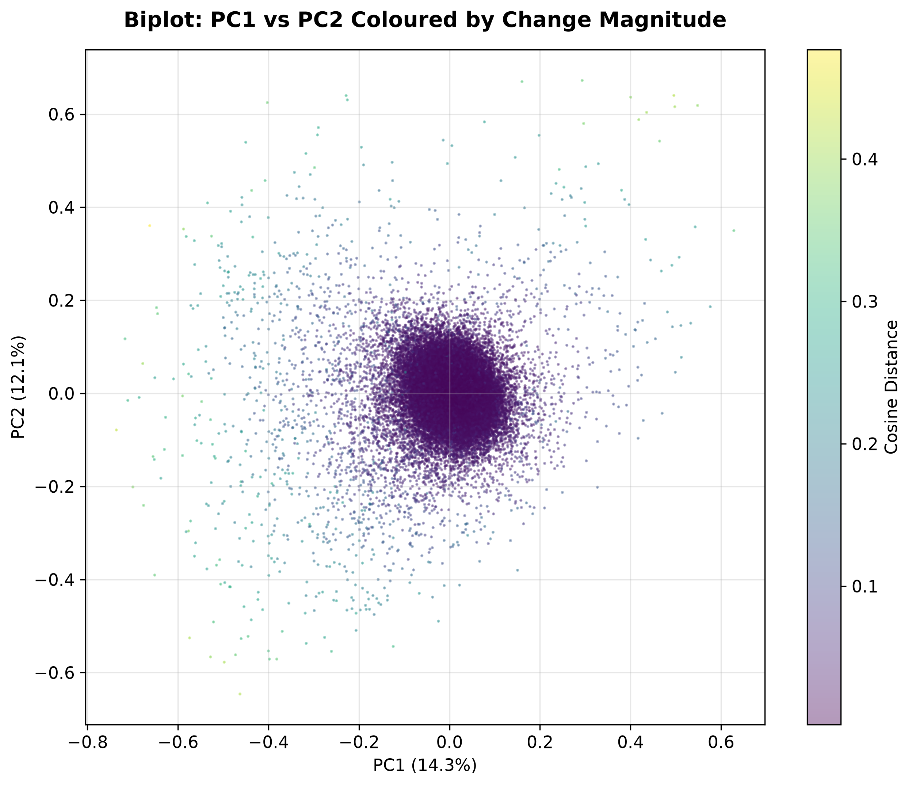

---

## 5. Spatial Hotspots

- Degradation hotspots (Z > 2.0): **4,650 pixels** (~46 ha)
- Resilience coldspots (Z < -1.0): **0 pixels** (~0 ha)
- Background pixels: **128,137**

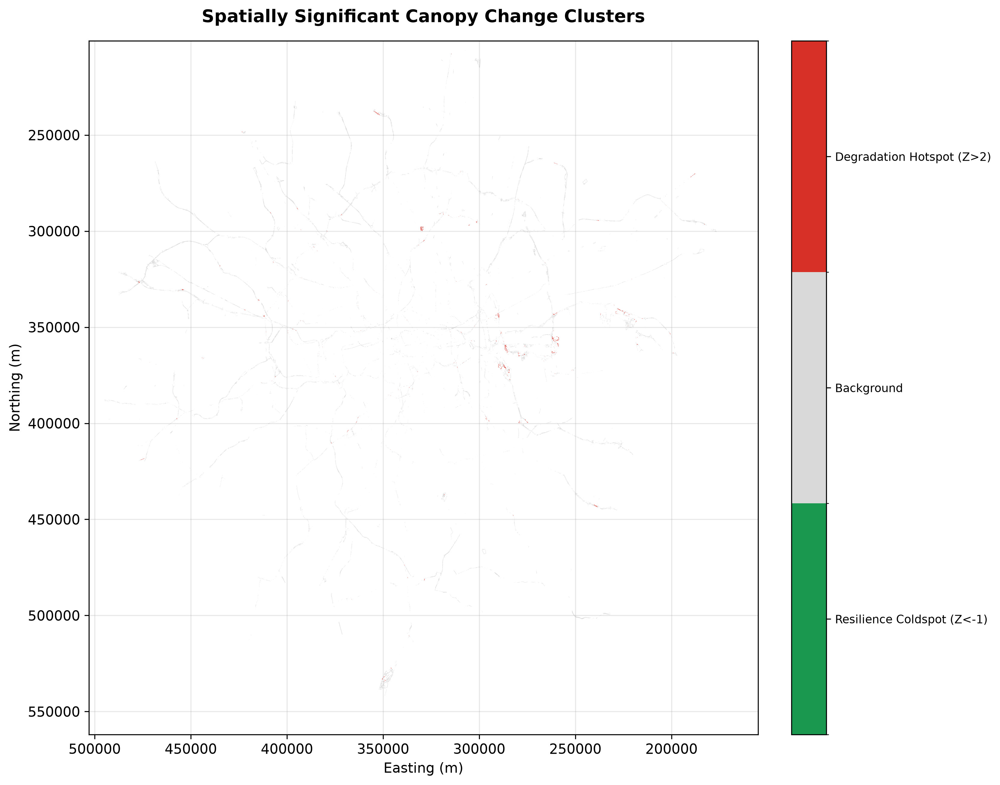

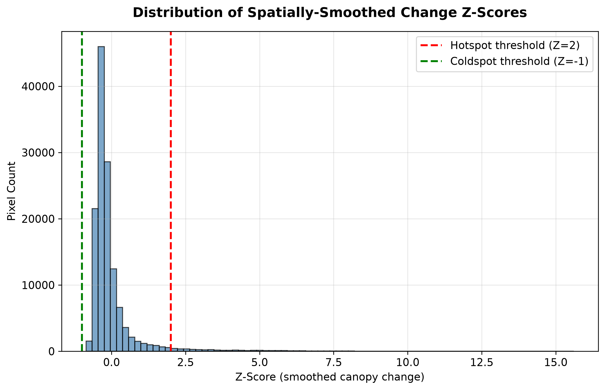

---

## 6. Land Attribute Vulnerability

### By Owning Organisation

| Organisation | Pixel Count | Mean Cosine Dist. | Stable | Mild Stress | Degraded |
|---|---|---|---|---|---|
| test | 2,799 | 0.0399 | 80.7% | 13.0% | 6.3% |
| GLA L & P | 12,133 | 0.0457 | 76.7% | 17.5% | 5.8% |
| Rail for London Limited | 2,652 | 0.0225 | 95.8% | 3.4% | 0.8% |
| Transport for London | 62,443 | 0.0222 | 95.4% | 3.8% | 0.8% |
| London Underground Limited | 49,056 | 0.0206 | 96.4% | 3.1% | 0.4% |
| London Bus Services Limited | 3,542 | 0.0196 | 96.6% | 3.1% | 0.3% |
| Greater London Authority | 44 | 0.0146 | 100.0% | 0.0% | 0.0% |
| London River Services Limited | 21 | 0.0180 | 95.2% | 4.8% | 0.0% |
| Tramtrack Croydon Limited | 75 | 0.0275 | 94.7% | 5.3% | 0.0% |
| Transport Trading Limited | 12 | 0.0126 | 100.0% | 0.0% | 0.0% |
| Victoria Coach Station Limited | 10 | 0.0093 | 100.0% | 0.0% | 0.0% |

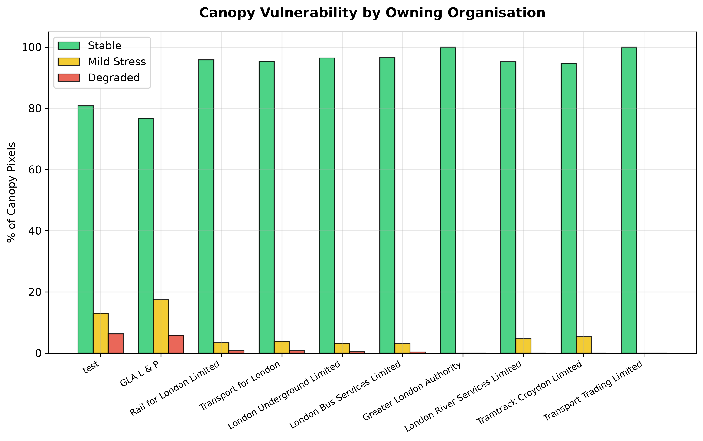

### By Land Interest

| Interest | Pixel Count | Mean Cosine Dist. | Stable | Mild Stress | Degraded |
|---|---|---|---|---|---|
| Leasehold | 4,264 | 0.0291 | 88.6% | 9.4% | 2.0% |
| Freehold | 118,560 | 0.0242 | 93.8% | 5.0% | 1.3% |
| Stratum | 9,963 | 0.0202 | 96.5% | 3.0% | 0.5% |

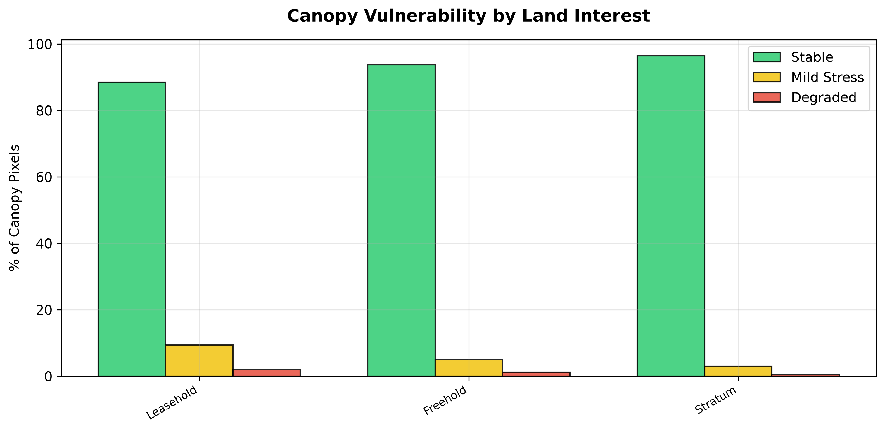

### By Company and Interest Class

| Category | Pixel Count | Mean Cosine Dist. | Stable | Mild Stress | Degraded |
|---|---|---|---|---|---|
| Docklands Light Railway Limited, Leasehold | 307 | 0.0673 | 65.5% | 16.9% | 17.6% |
| Rail for London Limited, Stratum | 168 | 0.0563 | 85.1% | 4.2% | 10.7% |
| Greater London Authority, Freehold | 11,380 | 0.0467 | 76.1% | 17.7% | 6.2% |
| Docklands Light Railway Limited, Freehold | 2,102 | 0.0398 | 80.0% | 14.2% | 5.8% |
| Transport for London, Leasehold | 1,073 | 0.0339 | 83.8% | 13.6% | 2.6% |
| Transport for London, Freehold | 58,815 | 0.0220 | 95.6% | 3.7% | 0.8% |
| London Underground Limited, Freehold | 41,897 | 0.0209 | 96.4% | 3.1% | 0.4% |
| London Underground Limited, Stratum | 6,828 | 0.0191 | 96.9% | 2.7% | 0.4% |
| London Bus Services Limited, Freehold | 3,199 | 0.0197 | 96.7% | 2.9% | 0.4% |
| Rail for London Limited, Leasehold | 1,331 | 0.0199 | 96.6% | 3.1% | 0.3% |
| Transport for London, Stratum | 2,577 | 0.0208 | 96.2% | 3.7% | 0.1% |
| Docklands Light Railway Limited, Stratum | 390 | 0.0190 | 96.7% | 3.3% | 0.0% |
| Greater London Authority, Leasehold | 797 | 0.0307 | 86.7% | 13.3% | 0.0% |
| London Bus Services Limited, Leasehold | 418 | 0.0204 | 95.0% | 5.0% | 0.0% |
| London River Services Limited, Freehold | 14 | 0.0218 | 92.9% | 7.1% | 0.0% |
| London Underground Limited, Leasehold | 331 | 0.0226 | 89.1% | 10.9% | 0.0% |
| Rail for London Limited, Freehold | 1,153 | 0.0207 | 96.4% | 3.6% | 0.0% |

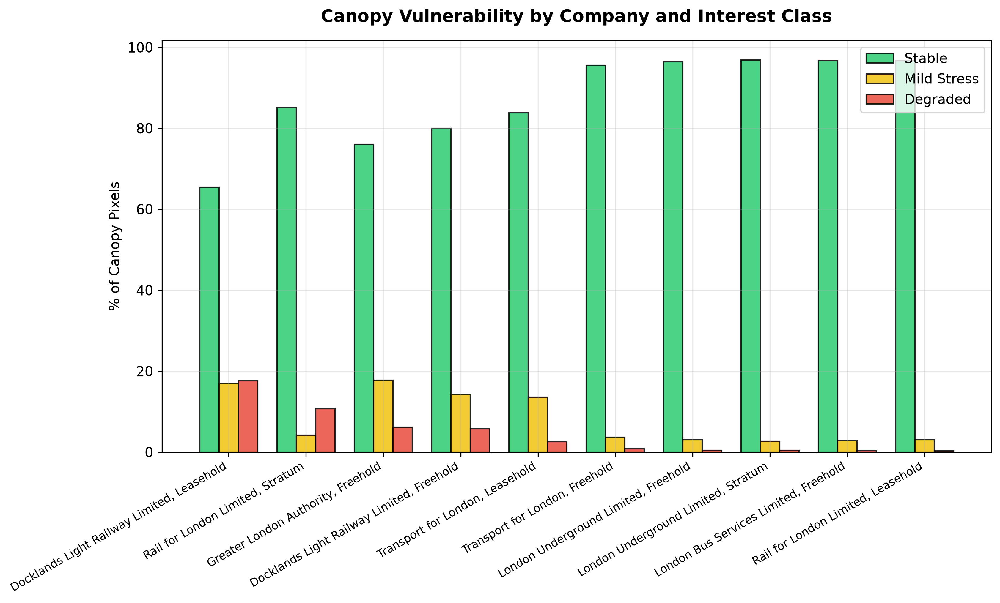

---

## 7. Borough-Level Distribution

| Borough | Pixel Count | Mean Cosine Dist. | Stable | Mild Stress | Degraded |
|---|---|---|---|---|---|
| Newham | 9,244 | 0.0427 | 80.4% | 13.3% | 6.3% |
| Haringey | 2,103 | 0.0367 | 80.2% | 15.1% | 4.8% |
| Greenwich | 5,812 | 0.0332 | 86.8% | 9.7% | 3.5% |
| Barking and Dagenham | 2,536 | 0.0337 | 84.0% | 13.1% | 3.0% |
| Wandsworth | 2,301 | 0.0231 | 94.6% | 3.0% | 2.3% |
| Lewisham | 1,382 | 0.0251 | 92.5% | 5.2% | 2.2% |
| Hackney | 1,216 | 0.0240 | 92.8% | 4.9% | 2.2% |
| Southwark | 1,480 | 0.0260 | 93.5% | 4.7% | 1.8% |
| Enfield | 5,128 | 0.0251 | 92.1% | 6.4% | 1.5% |
| Havering | 7,310 | 0.0303 | 89.9% | 8.6% | 1.5% |
| Waltham Forest | 3,012 | 0.0214 | 96.1% | 2.9% | 1.0% |
| Bromley | 4,235 | 0.0270 | 92.3% | 6.7% | 1.0% |
| Croydon | 6,491 | 0.0238 | 94.7% | 4.5% | 0.8% |
| Kensington and Chelsea | 1,332 | 0.0216 | 94.5% | 4.9% | 0.6% |
| Barnet | 11,294 | 0.0189 | 97.7% | 1.8% | 0.5% |
| Ealing | 7,768 | 0.0221 | 94.9% | 4.6% | 0.5% |
| Brent | 4,706 | 0.0186 | 97.0% | 2.6% | 0.4% |
| Westminster | 2,248 | 0.0187 | 97.2% | 2.4% | 0.4% |
| Hammersmith and Fulham | 2,133 | 0.0212 | 92.9% | 6.8% | 0.3% |
| Hillingdon | 9,125 | 0.0248 | 95.9% | 3.8% | 0.3% |
| Tower Hamlets | 5,334 | 0.0210 | 96.0% | 3.7% | 0.3% |
| Islington | 1,543 | 0.0162 | 97.4% | 2.3% | 0.3% |
| Hounslow | 6,245 | 0.0223 | 95.3% | 4.5% | 0.2% |
| Merton | 3,084 | 0.0160 | 98.7% | 1.2% | 0.1% |
| Redbridge | 8,353 | 0.0172 | 98.5% | 1.4% | 0.1% |
| Lambeth | 2,067 | 0.0167 | 97.6% | 2.4% | 0.0% |
| Harrow | 4,466 | 0.0201 | 98.0% | 2.0% | 0.0% |
| Bexley | 2,450 | 0.0181 | 99.4% | 0.6% | 0.0% |
| Camden | 1,490 | 0.0169 | 97.4% | 2.6% | 0.0% |
| City of London | 200 | 0.0157 | 99.0% | 1.0% | 0.0% |
| Kingston upon Thames | 1,397 | 0.0175 | 99.1% | 0.9% | 0.0% |
| Richmond upon Thames | 1,718 | 0.0165 | 99.2% | 0.8% | 0.0% |
| Sutton | 1,562 | 0.0190 | 97.8% | 2.2% | 0.0% |

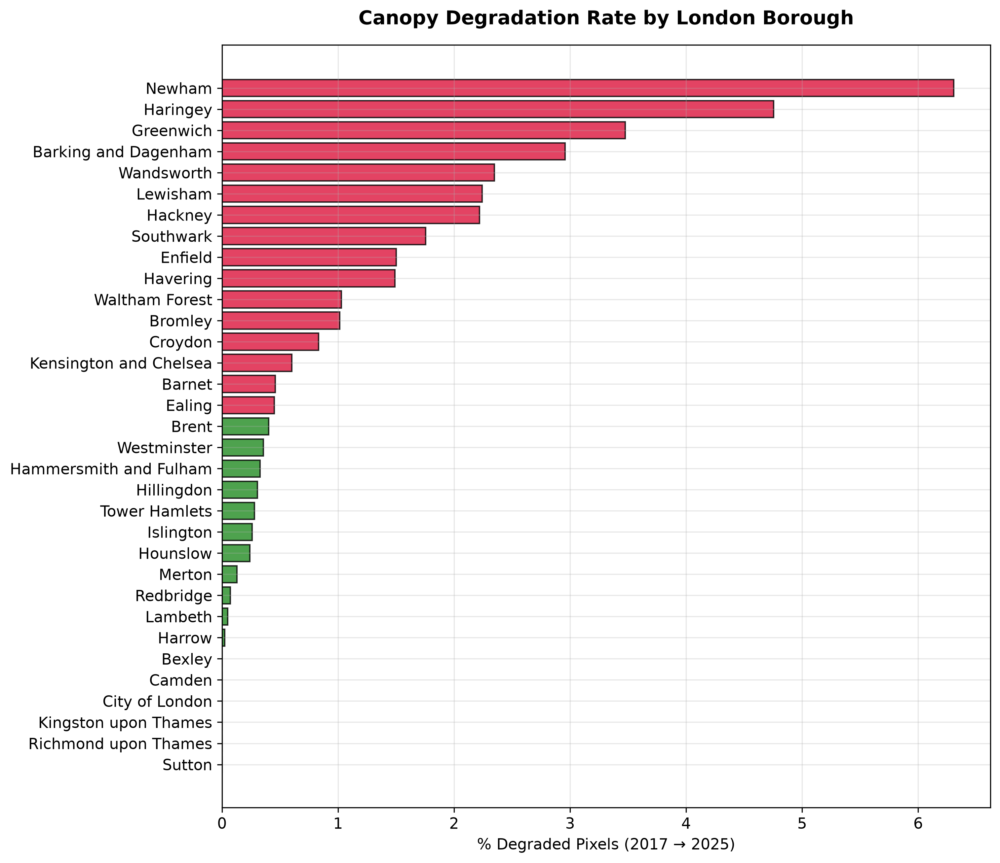

---

## 8. Conclusions

1. The analysis isolates the subset of London canopy pixels that are both within the precomputed TOW footprint and inside TFL/GLA land parcels.
2. The time-series quantifies where those estate lands remained stable, where gradual divergence accumulated, and where abrupt loss signatures emerged.
3. The organisation and tenure splits show whether canopy stress is concentrated in particular ownership or interest classes rather than being evenly distributed across the estate.
4. Hotspot and borough outputs provide a spatial triage layer for follow-up inspection, maintenance planning, or estate-level intervention prioritisation.
