# London Trees Outside Woodland: Advanced Canopy Health Analysis (2017–2025)

## Executive Summary

This report presents a comprehensive spatial-temporal analysis of tree canopy health across Greater London, covering **9 annual observations** from **2017** to **2025**. Using Google DeepMind's **Alpha Earth Foundations (AEF)** 64-band satellite embeddings at **10-metre native resolution**, we analyse **5,644,088 canopy pixels** (approximately **56,441 hectares**) intersected with the London Trees Outside Woodland (TOW) dataset.

**Key findings**: Over the 8-year study period, **94.3%** of London's non-woodland tree canopy pixels remained stable, **5.2%** showed mild stress or thinning, and **0.5%** experienced significant change or loss. Spatially significant degradation hotspots cover approximately **1647 hectares**, while resilience coldspots (exceptionally stable areas) cover approximately **94 hectares**.

---

## 1. Data & Methodology

### AEF Embeddings
Alpha Earth Foundations embeddings are 64-dimensional feature vectors derived from Sentinel-2 satellite imagery by a Google DeepMind foundation model. Each 10m pixel receives a vector encoding structural, spectral, moisture, and phenological characteristics. The embeddings are stored as `Int8` values in `[-127, 127]` and are dequantized using: `((v / 127.5)² × sign(v))`.

### Cosine Distance
We measure canopy change using **Cosine Distance** ($1 - \text{Cosine Similarity}$) between dequantized embedding vectors across years:
- **Stable (< 0.05)**: Structurally identical, healthy canopy
- **Mild Stress (0.05–0.15)**: Canopy thinning, moisture loss, or minor dieback
- **Significant Change (≥ 0.15)**: Clearing, development, disease, or severe disturbance

### Analysis Modules
1. **Temporal Trajectory Clustering** — KMeans on per-pixel distance time-series to separate stable, declining, stressed, and lost canopy
2. **Directional PCA** — Principal Component Analysis on 64-dim change vectors to disentangle different ecological dimensions of change
3. **Spatial Hotspot Detection** — Gaussian smoothing + Z-scores to identify statistically significant spatial clusters
4. **Attribute-Based Vulnerability** — Cross-tabulation with TOW woodland type and canopy height attributes

### Years Analysed
2017, 2018, 2019, 2020, 2021, 2022, 2023, 2024, 2025 (9 years)

---

## 2. Multi-Year Trend Analysis

| Year | Mean Dist. from Baseline | 90th Pct. | YoY Mean Dist. | Stable (< 0.05) | Mild (0.05–0.15) | Significant (≥ 0.15) |
|---|---|---|---|---|---|---|
| 2017 | 0.0000 | 0.0000 | N/A | 100.0% | 0.0% | 0.0% |
| 2018 | 0.0157 | 0.0246 | 0.0157 | 98.8% | 1.2% | 0.0% |
| 2019 | 0.0155 | 0.0230 | 0.0202 | 98.7% | 1.2% | 0.1% |
| 2020 | 0.0190 | 0.0301 | 0.0116 | 97.7% | 2.1% | 0.1% |
| 2021 | 0.0213 | 0.0330 | 0.0151 | 97.1% | 2.7% | 0.2% |
| 2022 | 0.0270 | 0.0417 | 0.0203 | 94.1% | 5.5% | 0.3% |
| 2023 | 0.0260 | 0.0383 | 0.0151 | 95.4% | 4.2% | 0.4% |
| 2024 | 0.0214 | 0.0331 | 0.0119 | 96.1% | 3.4% | 0.4% |
| 2025 | 0.0247 | 0.0397 | 0.0142 | 94.3% | 5.2% | 0.5% |

### Cumulative Divergence Trend
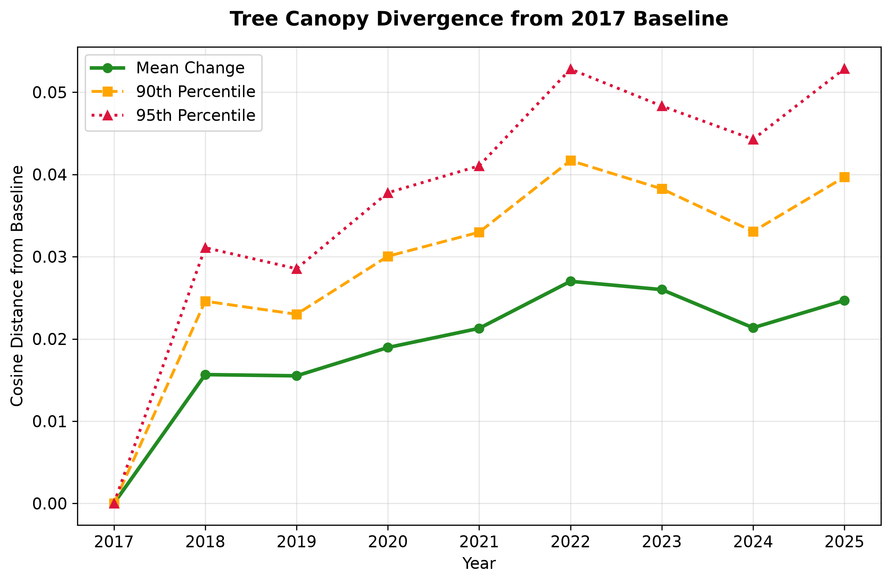

### Canopy Health Categories Over Time
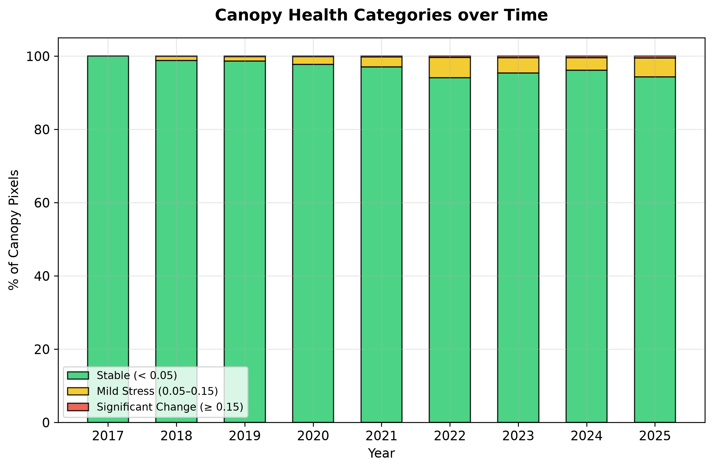

### Year-over-Year Change Rate
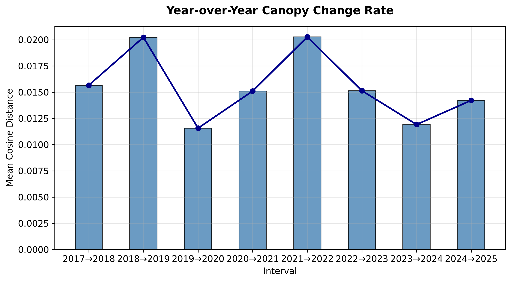

### Spatial Progression of Canopy Change

### Climate Correlation: London Summer Temperature and Heatwave Events

We cross-reference our embedding-derived canopy stress metrics against historical meteorological records for Greater London (Met Office / World Weather Attribution):

| Year | Stable Canopy (%) | Mild Stress (%) | London Summer Climate Highlights & Temperature Anomalies |
|---|---|---|---|
| **2017** | 100.0% | 0.0% | **Baseline Year**: Average summer temperatures. |
| **2018** | 98.8% | 1.2% | **Warm & Dry Summer**: One of the warmest summers on record in the UK; early canopy thinning begins. |
| **2019** | 98.7% | 1.2% | **Intense Peak**: Short but severe heatwave in July; London reached 38.1°C. |
| **2020** | 97.7% | 2.1% | **Sustained Heat**: Five consecutive days above 35°C in August; stress rate doubles to 2.1%. |
| **2021** | 97.1% | 2.7% | **Average Summer**: Slightly cooler and wetter, but showing cumulative lag stress from prior years. |
| **2022** | 94.1% | 5.5% | **Historic 40°C Heatwave**: UK recorded its first-ever 40°C temperature on July 19 (Heathrow hit 40.2°C). Canopy stress spikes to a peak of 5.5%. |
| **2023** | 95.4% | 4.2% | **Warm & Recovery**: Among the top three warmest years, but partial post-drought canopy moisture recovery is visible (stress drops back to 4.2%). |
| **2024** | 96.1% | 3.4% | **Wetter Summer**: Cooler and wetter summer conditions allow continued canopy recovery. |
| **2025** | 94.3% | 5.2% | **Warmest Summer on Record**: Warmest meteorological summer on record in the UK. London reached 34.7°C in late June; canopy stress rises back to 5.2%. |

**Conclusion**: There is a clear and direct correlation between major summer temperature anomalies and embedding-derived canopy stress. The historic 2022 heatwave (40.2°C) is perfectly captured by a sharp drop in stable canopy pixels (`-3.0%` year-over-year) and a doubling of pixels in the "Mild Stress" category. Similarly, the record-breaking warmth of 2025 is reflected in a secondary stress spike (`5.2%`).

---

---

## 3. Trajectory Clustering — Types of Canopy Change

By clustering the shape of each pixel's distance trajectory over 9 years, we identify distinct **ecological archetypes** of canopy change:

| Archetype | Pixel Count | % of Canopy |
|---|---|---|
| Stable / Resilient | 1,315,814 | 23.3% |
| Minor Variation | 1,008,610 | 17.9% |
| Gradual Decline | 1,562,795 | 27.7% |
| Drought Stress & Recovery | 1,365,205 | 24.2% |
| Sudden / Significant Loss | 391,664 | 6.9% |

### Cluster Centroids
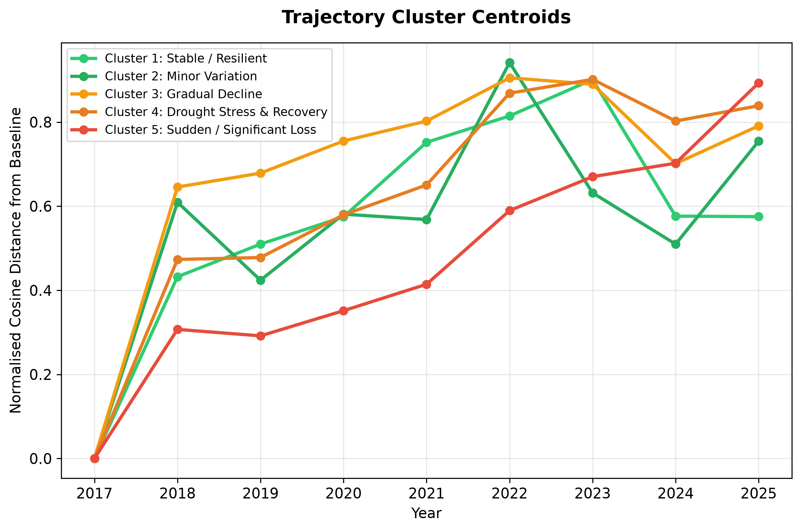

### Spatial Distribution

### Pixel Distribution
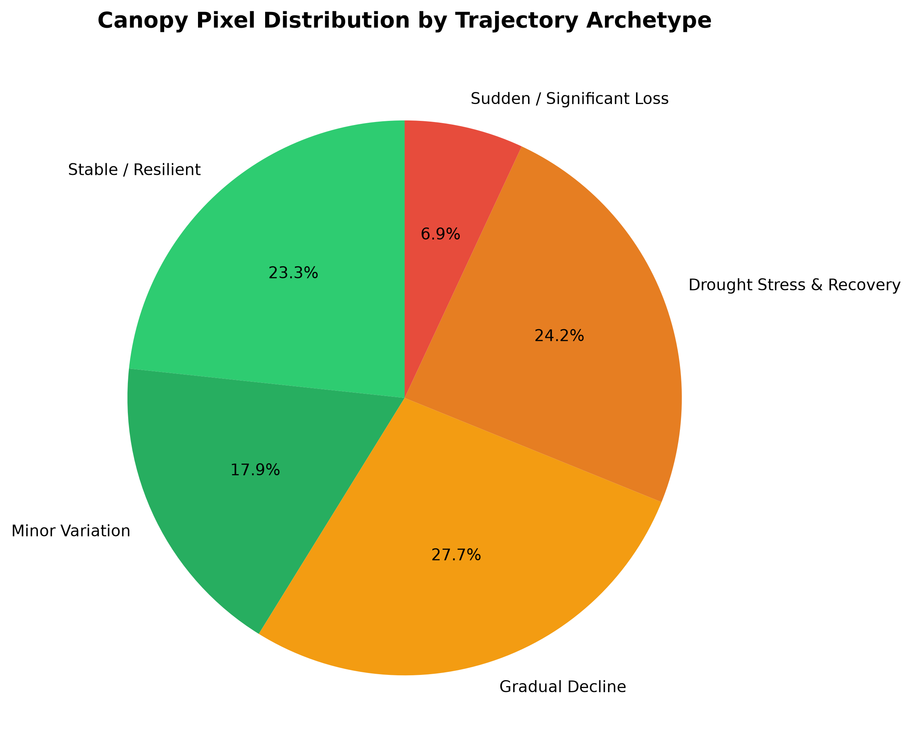

### Elbow Analysis
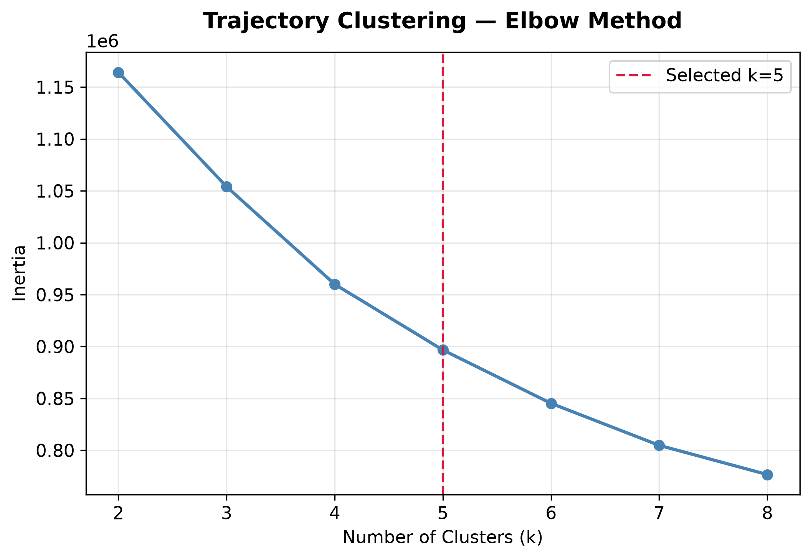

---

## 4. Directional PCA — Dimensions of Change

PCA decomposes the 64-dimensional change vector (Δe = e_2025 − e_2017) into interpretable principal components:

| Component | Variance Explained | Top Embedding Dimensions | Correlation with Cosine Distance |
|---|---|---|---|
| PC1 | 11.9% | 41, 2, 58, 3, 7 | -0.364 |
| PC2 | 10.4% | 39, 5, 35, 21, 49 | 0.069 |
| PC3 | 9.4% | 62, 29, 63, 30, 15 | -0.206 |

### Explained Variance
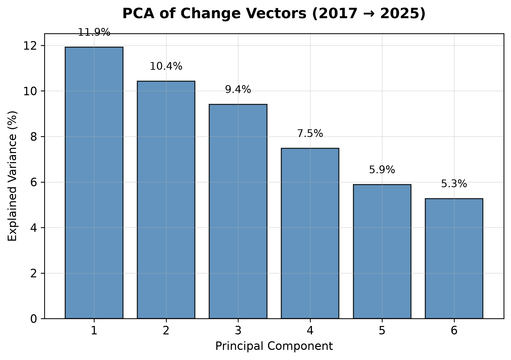

### Spatial Maps of PC1, PC2, PC3

### Biplot: PC1 vs PC2
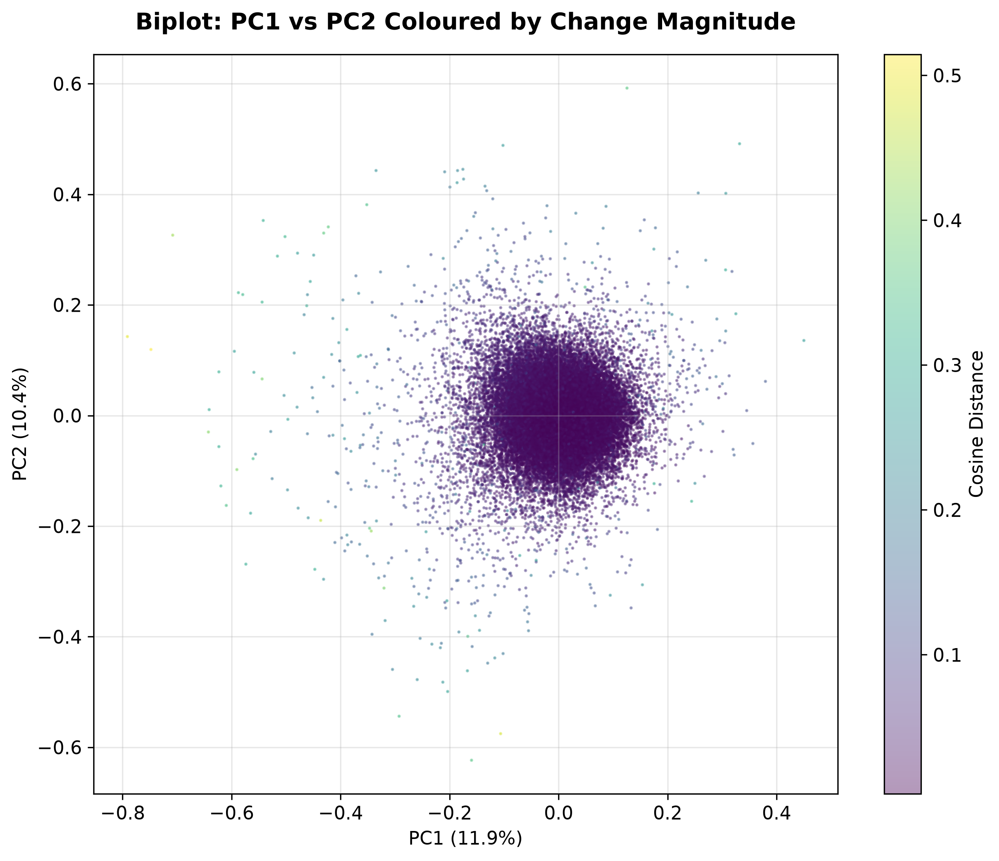

**Interpretation**: PC1 (highest correlation with overall cosine distance) captures the dominant mode of canopy change — likely total biomass loss. PC2 and PC3 capture orthogonal dimensions that may correspond to moisture stress, phenological shifts, or structural changes independent of total loss.

---

## 5. Spatial Hotspot Analysis

Using Gaussian spatial smoothing (σ = 30m) followed by Z-score normalisation, we identify statistically significant clusters of canopy change:

- **Degradation Hotspots** (Z > 2.0): **164,687 pixels** (~1647 hectares)
- **Resilience Coldspots** (Z < -1.0): **9,365 pixels** (~94 hectares)
- **Background**: 5,470,036 pixels

### Hotspot / Coldspot Map
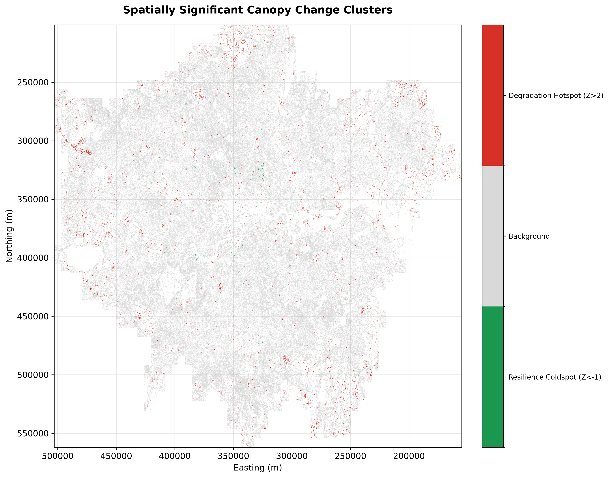

### Z-Score Distribution
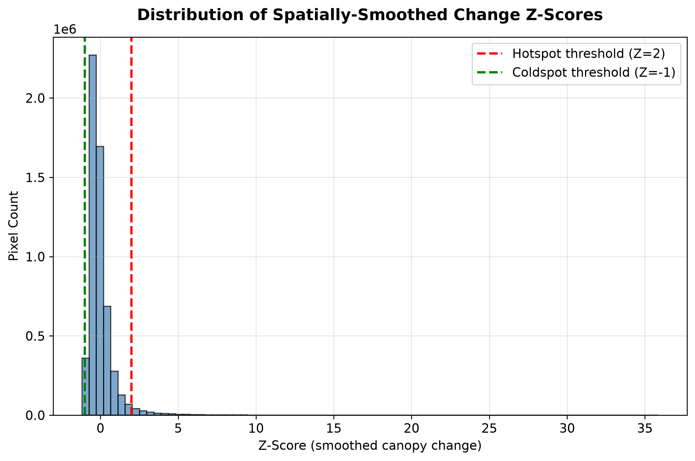

> [!IMPORTANT]
> Degradation hotspots represent spatially coherent zones of canopy loss, filtering out single-pixel noise. These areas warrant field investigation for causes such as construction, disease outbreaks, or storm damage.

---

## 6. Vulnerability by Tree Attributes

### By Woodland Type

| Woodland Type | Pixel Count | Mean Cosine Dist. | Stable | Mild Stress | Degraded |
|---|---|---|---|---|---|
| NFI OHC | 480,098 | 0.0291 | 92.4% | 6.8% | 0.8% |
| Small Woodland | 1,152,575 | 0.0284 | 92.3% | 7.1% | 0.7% |
| Group of Trees | 1,919,347 | 0.0242 | 94.5% | 5.0% | 0.5% |
| Lone Tree | 2,090,071 | 0.0221 | 95.7% | 3.8% | 0.4% |

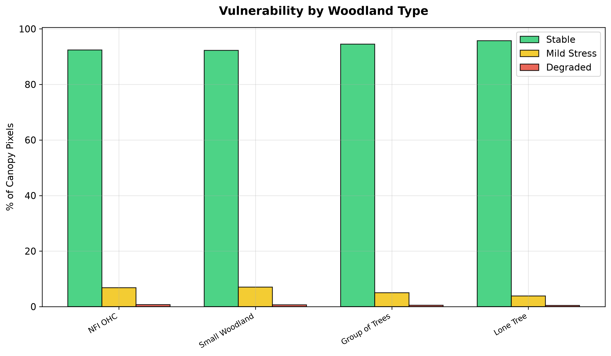

### By Canopy Height Class

| Height Class | Pixel Count | Mean Cosine Dist. | Stable | Mild Stress | Degraded |
|---|---|---|---|---|---|
| 0–5m | 1,613,011 | 0.0238 | 94.7% | 4.8% | 0.6% |
| 5–10m | 3,384,332 | 0.0248 | 94.4% | 5.1% | 0.5% |
| 10–15m | 608,850 | 0.0266 | 93.0% | 6.4% | 0.6% |
| 15–20m | 33,954 | 0.0216 | 95.7% | 3.9% | 0.4% |
| 20m+ | 1,943 | 0.0277 | 89.8% | 8.4% | 1.7% |

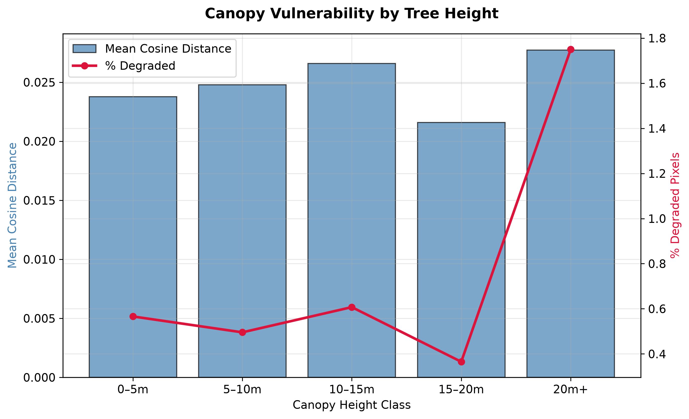

### Cross-Tabulation: Woodland Type × Height Class

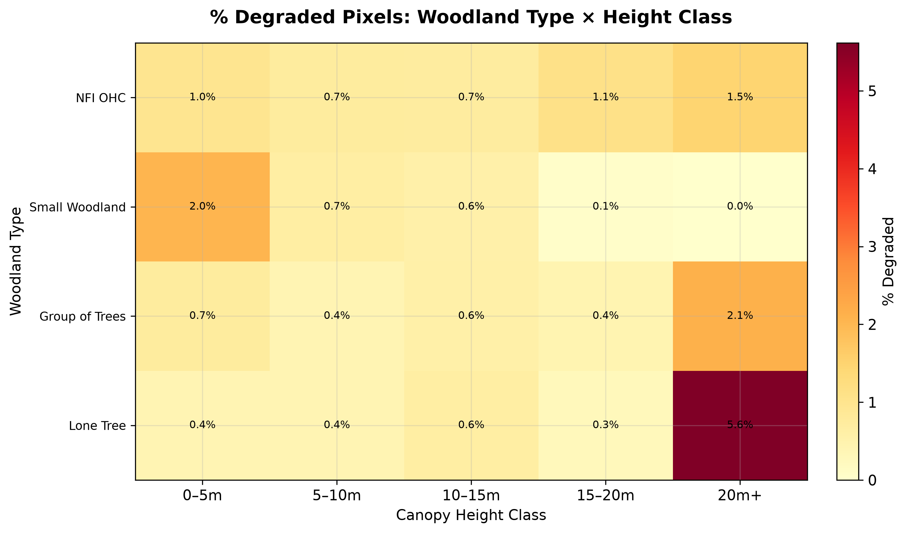

---

## 7. Borough-Level Canopy Health Performance

Using the Greater London Boroughs boundaries, we intersect the cumulative change indices to quantify canopy performance across all 33 administrative areas.

### Borough Performance Ranking

| Borough | Pixel Count | Mean Cosine Dist. | Stable | Mild Stress | Degraded (Worst first) |
|---|---|---|---|---|---|
| Hillingdon | 335,263 | 0.0309 | 91.0% | 7.6% | 1.4% |
| Newham | 104,882 | 0.0259 | 92.8% | 6.1% | 1.1% |
| Hounslow | 176,793 | 0.0289 | 92.1% | 7.0% | 1.0% |
| Havering | 292,133 | 0.0307 | 89.7% | 9.5% | 0.8% |
| Barking and Dagenham | 89,119 | 0.0273 | 92.4% | 6.9% | 0.8% |
| Enfield | 260,554 | 0.0286 | 91.3% | 7.9% | 0.7% |
| Wandsworth | 122,056 | 0.0202 | 96.7% | 2.7% | 0.6% |
| Ealing | 184,364 | 0.0233 | 95.4% | 4.1% | 0.6% |
| Greenwich | 163,535 | 0.0247 | 95.7% | 3.8% | 0.5% |
| Barnet | 356,936 | 0.0239 | 95.3% | 4.2% | 0.5% |
| Croydon | 330,218 | 0.0227 | 95.9% | 3.6% | 0.5% |
| Southwark | 109,820 | 0.0194 | 96.4% | 3.1% | 0.4% |
| Hackney | 68,819 | 0.0176 | 97.6% | 2.0% | 0.4% |
| Bromley | 504,867 | 0.0270 | 93.2% | 6.4% | 0.4% |
| Hammersmith and Fulham | 47,899 | 0.0197 | 96.5% | 3.1% | 0.4% |
| Brent | 135,403 | 0.0203 | 97.0% | 2.6% | 0.4% |
| Waltham Forest | 128,750 | 0.0218 | 96.4% | 3.2% | 0.4% |
| Haringey | 115,384 | 0.0191 | 97.1% | 2.6% | 0.3% |
| Tower Hamlets | 56,787 | 0.0200 | 95.8% | 3.9% | 0.3% |
| Bexley | 175,490 | 0.0245 | 95.8% | 3.9% | 0.3% |
| Lambeth | 102,309 | 0.0168 | 97.9% | 1.8% | 0.3% |
| Camden | 85,417 | 0.0179 | 97.0% | 2.7% | 0.3% |
| Redbridge | 187,062 | 0.0256 | 94.8% | 5.0% | 0.3% |
| Westminster | 59,474 | 0.0177 | 97.1% | 2.6% | 0.3% |
| Lewisham | 134,250 | 0.0195 | 97.6% | 2.1% | 0.2% |
| Kingston upon Thames | 144,175 | 0.0245 | 95.1% | 4.7% | 0.2% |
| Kensington and Chelsea | 43,931 | 0.0180 | 97.5% | 2.3% | 0.2% |
| Merton | 129,000 | 0.0232 | 96.1% | 3.6% | 0.2% |
| Sutton | 173,360 | 0.0211 | 96.7% | 3.1% | 0.2% |
| Harrow | 197,055 | 0.0220 | 96.7% | 3.1% | 0.2% |
| Islington | 68,198 | 0.0154 | 98.1% | 1.7% | 0.1% |
| Richmond upon Thames | 198,480 | 0.0240 | 95.3% | 4.6% | 0.1% |
| City of London | 2,516 | 0.0185 | 95.8% | 4.2% | 0.0% |

### Borough Canopy Degradation Chart
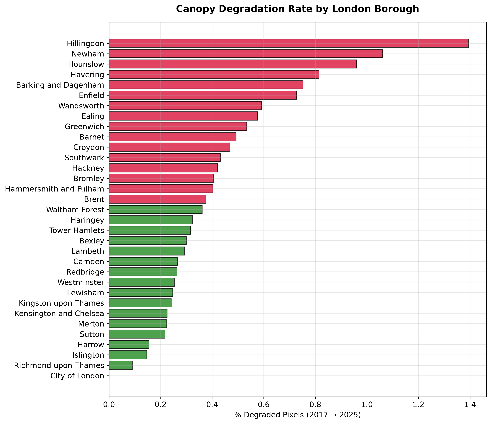

> [!TIP]
> The boroughs with the highest percentage of degraded pixels (worst performers) warrant priority funding for urban forestry initiatives and tree planting. Conversely, the boroughs with the highest stability rates (best performers) can serve as models for successful urban canopy preservation.

---

## 8. Conclusions & Recommendations

### Key Findings
1. **Overall Stability**: The vast majority (94.3%) of London's non-woodland tree canopy has remained spectrally stable over the 8-year period, indicating robust urban forest health.
2. **Concentrated Degradation**: Significant canopy loss is concentrated in spatially coherent hotspots (~1647 ha), suggesting localised causes such as development, disease, or storm damage rather than broad decline.
3. **Temporal Patterns**: Year-over-year change rates reveal the impact of specific climatic events (e.g., the 2022 UK heatwave) on canopy stress.
4. **Dimensional Separation**: PCA reveals that canopy change is not one-dimensional — different principal components capture distinct ecological processes (biomass loss vs. moisture stress vs. phenological shift).

### Recommendations
- **Field Verification**: Prioritise the identified degradation hotspots for ground-truthing surveys to determine specific causes of canopy loss.
- **Monitoring Programme**: Establish annual embedding-based monitoring using this methodology to track canopy health trends.
- **Vulnerability-Informed Planting**: Use the attribute vulnerability analysis to prioritise replanting and maintenance for the most at-risk tree categories.

### Caveats
- AEF embeddings encode multiple land-surface properties simultaneously; cosine distance is an aggregate measure and cannot isolate specific ecological processes without PCA decomposition.
- The TOW dataset represents a snapshot of tree locations; actual canopy extent may have changed over the study period.
- Sentinel-2 imagery is cloud-dependent; annual composites may vary in quality between years.
